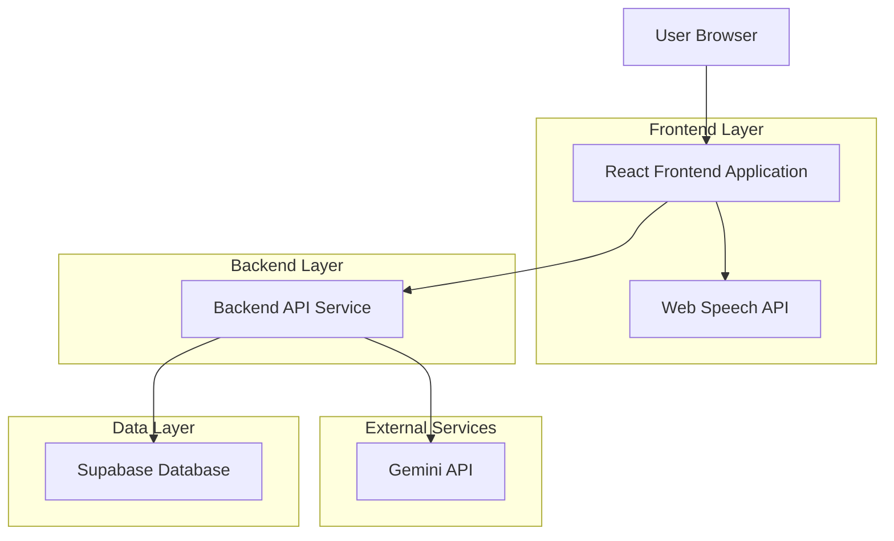
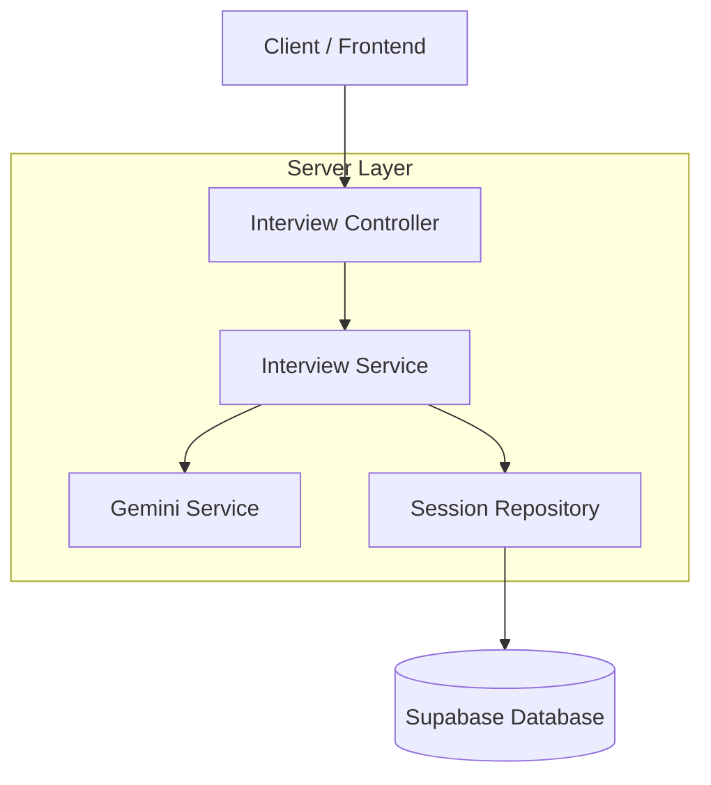
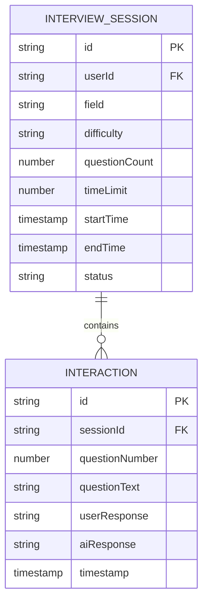

## 1. Architecture Design



## 2. Technology Description
- Frontend: React@18 + tailwindcss@3 + vite
- Initialization Tool: vite-init
- Backend: Express@4
- Database: Supabase (PostgreSQL)
- Speech Recognition: Web Speech API (browser-native)
- Text-to-Speech: Web Speech API SpeechSynthesis
- AI Integration: Google Gemini API

## 3. Route Definitions
| Route | Purpose |
|-------|---------|
| / | Dashboard page for interview configuration |
| /interview | Active interview session with voice interface |
| /results | Interview results and evaluation display |
| /api/interview/start | Initialize interview session and generate questions |
| /api/interview/process | Process user response and get AI reply |
| /api/interview/evaluate | Generate final evaluation from complete session |

## 4. API Definitions

### 4.1 Interview Initialization
```
POST /api/interview/start
```

Request:
| Param Name | Param Type | isRequired | Description |
|------------|------------|-------------|-------------|
| field | string | true | Interview field/domain (e.g., "software engineering") |
| difficulty | string | true | Difficulty level: "beginner", "intermediate", "advanced" |
| questionCount | number | true | Number of questions: 5-20 |
| timeLimit | number | true | Time limit in minutes: 10-60 |

Response:
| Param Name | Param Type | Description |
|------------|-------------|-------------|
| sessionId | string | Unique interview session identifier |
| greeting | string | AI-generated greeting message |
| firstQuestion | string | First interview question |

Example:
```json
{
  "field": "software engineering",
  "difficulty": "intermediate",
  "questionCount": 10,
  "timeLimit": 30
}
```

### 4.2 Response Processing
```
POST /api/interview/process
```

Request:
| Param Name | Param Type | isRequired | Description |
|------------|------------|-------------|-------------|
| sessionId | string | true | Interview session identifier |
| userResponse | string | true | User's transcribed response |
| questionNumber | number | true | Current question number |

Response:
| Param Name | Param Type | Description |
|------------|-------------|-------------|
| nextQuestion | string | Next interview question or follow-up |
| isComplete | boolean | Whether interview should conclude |

### 4.3 Final Evaluation
```
POST /api/interview/evaluate
```

Request:
| Param Name | Param Type | isRequired | Description |
|------------|------------|-------------|-------------|
| sessionId | string | true | Interview session identifier |
| fullTranscript | array | true | Complete Q&A transcript |

Response:
| Param Name | Param Type | Description |
|------------|-------------|-------------|
| overallScore | number | Interview performance score (1-10) |
| strengths | array | List of identified strengths |
| improvements | array | Areas for improvement |
| detailedFeedback | string | Comprehensive evaluation text |

## 5. Server Architecture Diagram



## 6. Data Model

### 6.1 Data Model Definition


### 6.2 Data Definition Language

Interview Sessions Table (interview_sessions)
```sql
-- create table
CREATE TABLE interview_sessions (
    id UUID PRIMARY KEY DEFAULT gen_random_uuid(),
    user_id UUID REFERENCES auth.users(id),
    field VARCHAR(100) NOT NULL,
    difficulty VARCHAR(20) CHECK (difficulty IN ('beginner', 'intermediate', 'advanced')),
    question_count INTEGER NOT NULL CHECK (question_count BETWEEN 5 AND 20),
    time_limit INTEGER NOT NULL CHECK (time_limit BETWEEN 10 AND 60),
    start_time TIMESTAMP WITH TIME ZONE DEFAULT NOW(),
    end_time TIMESTAMP WITH TIME ZONE,
    status VARCHAR(20) DEFAULT 'active' CHECK (status IN ('active', 'completed', 'abandoned')),
    created_at TIMESTAMP WITH TIME ZONE DEFAULT NOW()
);

-- create index
CREATE INDEX idx_interview_sessions_user_id ON interview_sessions(user_id);
CREATE INDEX idx_interview_sessions_status ON interview_sessions(status);
```

Interactions Table (interactions)
```sql
-- create table
CREATE TABLE interactions (
    id UUID PRIMARY KEY DEFAULT gen_random_uuid(),
    session_id UUID REFERENCES interview_sessions(id),
    question_number INTEGER NOT NULL,
    question_text TEXT NOT NULL,
    user_response TEXT,
    ai_response TEXT,
    timestamp TIMESTAMP WITH TIME ZONE DEFAULT NOW()
);

-- create index
CREATE INDEX idx_interactions_session_id ON interactions(session_id);
CREATE INDEX idx_interactions_question_number ON interactions(question_number);
```

### 6.3 Supabase Row Level Security Policies
```sql
-- Grant basic read access to authenticated users
GRANT SELECT ON interview_sessions TO authenticated;
GRANT SELECT ON interactions TO authenticated;

-- Grant full access to authenticated users for their own data
GRANT ALL PRIVILEGES ON interview_sessions TO authenticated;
GRANT ALL PRIVILEGES ON interactions TO authenticated;

-- Create RLS policies
ALTER TABLE interview_sessions ENABLE ROW LEVEL SECURITY;
ALTER TABLE interactions ENABLE ROW LEVEL SECURITY;

-- Users can only see their own sessions
CREATE POLICY "Users can view own sessions" ON interview_sessions
    FOR SELECT USING (auth.uid() = user_id);

-- Users can only insert sessions for themselves
CREATE POLICY "Users can create own sessions" ON interview_sessions
    FOR INSERT WITH CHECK (auth.uid() = user_id);

-- Users can only update their own sessions
CREATE POLICY "Users can update own sessions" ON interview_sessions
    FOR UPDATE USING (auth.uid() = user_id);
```