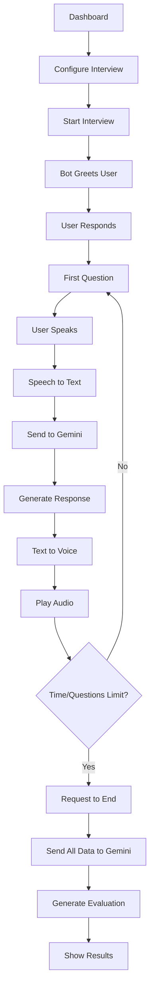

## 1. Product Overview
A voice-powered interview preparation platform where users configure interview parameters through a dashboard and engage in realistic voice conversations with an AI interviewer. The system provides real-time speech-to-text conversion, AI-generated responses, and comprehensive interview evaluation.

This helps job seekers practice interviews naturally through voice interaction, receiving personalized feedback based on their field and difficulty level.

## 2. Core Features

### 2.1 User Roles
| Role | Registration Method | Core Permissions |
|------|---------------------|------------------|
| Job Seeker | Email registration | Configure interviews, participate in voice sessions, view results |

### 2.2 Feature Module
Our voice interview platform consists of the following main pages:
1. **Dashboard**: Interview configuration form, difficulty selection, field specification, timing controls
2. **Interview Session**: Voice interaction interface, real-time transcription, question display, audio controls
3. **Results**: Interview evaluation, performance feedback, improvement suggestions

### 2.3 Page Details
| Page Name | Module Name | Feature description |
|-----------|-------------|---------------------|
| Dashboard | Configuration Form | Select interview field, choose difficulty level (beginner/intermediate/advanced), set question count (5-20), set time limit (10-60 minutes) |
| Dashboard | Start Button | Validate configuration and initiate interview session, send parameters to Gemini API for question generation |
| Interview Session | Voice Interface | Display bot greeting, show real-time speech-to-text transcription of user responses, play AI-generated voice responses |
| Interview Session | Question Display | Present current question text, show question number and progress indicator, display remaining time |
| Interview Session | Audio Controls | Start/stop voice recording, microphone permission handling, volume adjustment for AI responses |
| Results | Evaluation Report | Display comprehensive interview analysis from Gemini, show strengths and areas for improvement, provide specific feedback on responses |
| Results | Session Summary | List all questions asked, show user responses, indicate time spent per question |

## 3. Core Process
The user begins by accessing the dashboard to configure their interview parameters. After selecting their field, difficulty level, number of questions, and time limit, they click "Start Interview" to begin the session.

The interview flow follows this sequence: The AI bot greets the user first, waiting for the user's greeting response. Once the user responds, the first interview question appears. Throughout the interview, the system continuously converts user speech to text in real-time. When the user stops speaking, their transcribed response is sent to Gemini, which generates an appropriate follow-up question or response. The AI's text response is converted to voice and played back to the user.

This question-answer loop continues until the preset time limit approaches or the maximum number of questions is reached. Near the end, the AI suggests concluding the interview. The session automatically closes, and all questions and answers are sent to Gemini for comprehensive evaluation. The user then receives detailed feedback on their performance.

## 4. User Interface Design

### 4.1 Design Style
- **Primary Colors**: Deep blue (#1E3A8A) for headers, white (#FFFFFF) for backgrounds
- **Secondary Colors**: Light gray (#F3F4F6) for cards, green (#10B981) for success states
- **Button Style**: Rounded corners with subtle shadows, primary actions in blue, secondary in gray
- **Font**: Inter for headings (18-24px), Roboto for body text (14-16px)
- **Layout**: Card-based design with clear visual hierarchy, top navigation bar
- **Icons**: Material Design icons for consistency, microphone and audio-related emoji for voice features

### 4.2 Page Design Overview
| Page Name | Module Name | UI Elements |
|-----------|-------------|-------------|
| Dashboard | Configuration Form | Clean card layout with dropdown selectors for field/difficulty, numeric inputs for questions/time, prominent blue start button centered below form |
| Interview Session | Voice Interface | Large microphone icon showing recording status, real-time transcription box below, question display card at top, progress bar showing time/questions remaining |
| Interview Session | Audio Controls | Floating action button for microphone toggle, volume slider in settings panel, visual waveform during recording |
| Results | Evaluation Report | Scorecard design with metrics, detailed feedback in expandable sections, action items highlighted in colored boxes |

### 4.3 Responsiveness
Desktop-first design approach with mobile responsiveness. Touch interaction optimized for mobile devices with larger tap targets for voice controls. Responsive layout adapts from multi-column dashboard to single-column mobile view.

### 4.4 Voice Interface Guidelines
- Clear visual indicators for recording status (red dot when active)
- Smooth animations for state transitions
- Accessible design with keyboard shortcuts for voice controls
- Clear feedback when speech is being processed
- Visual confirmation when AI response is being generated