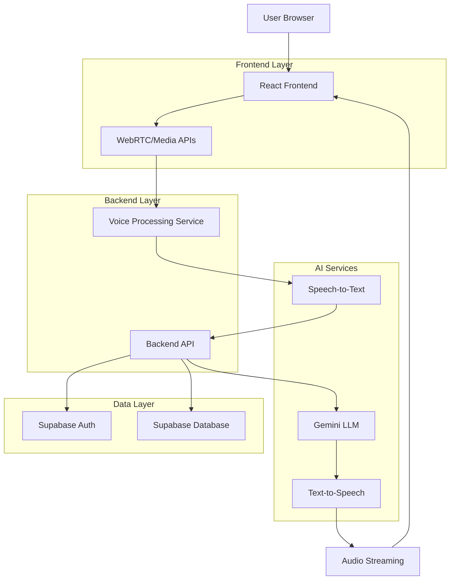
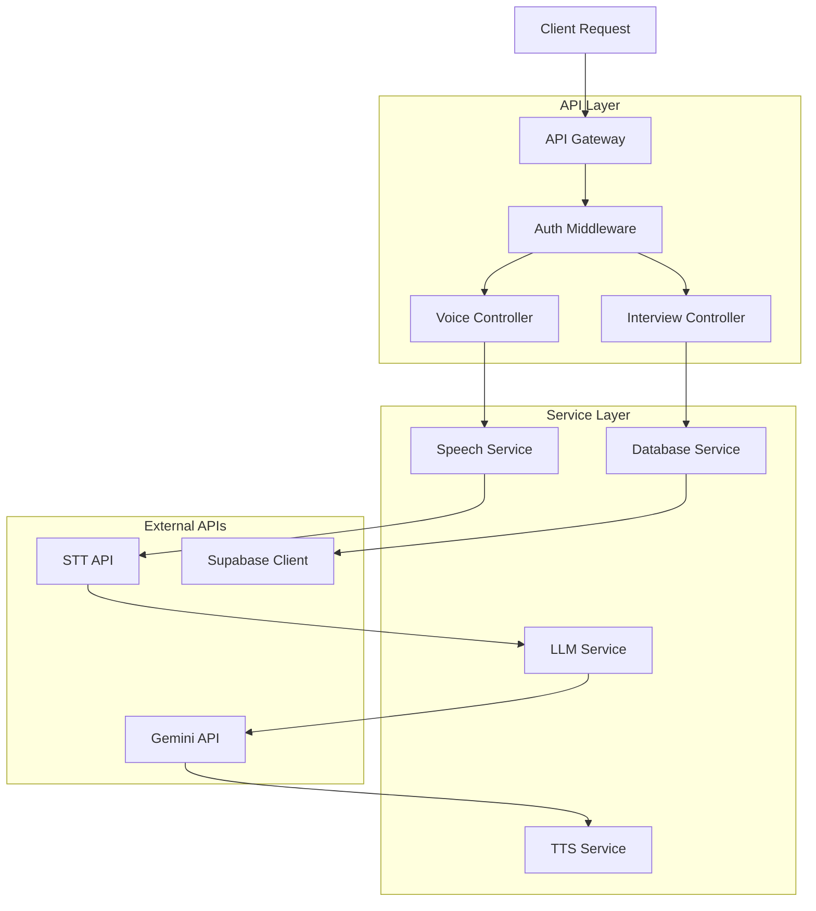
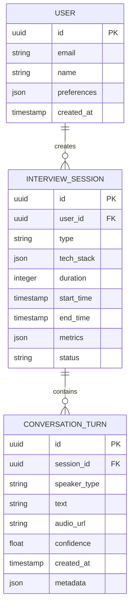

## 1. Architecture design



## 2. Technology Description
- **Frontend**: React@18 + tailwindcss@3 + vite + WebRTC APIs
- **Initialization Tool**: vite-init
- **Backend**: Node.js@20 + Express@4
- **Database**: Supabase (PostgreSQL)
- **AI Services**: Google Gemini API, Google Speech-to-Text, Google Text-to-Speech
- **Real-time Communication**: Socket.io, WebRTC

## 3. Route definitions
| Route | Purpose |
|-------|---------|
| / | Dashboard with interview history and quick start |
| /interview/:id | Live interview room with voice interface |
| /profile | User profile and interview preferences |
| /auth/login | User authentication |
| /auth/register | New user registration |
| /analytics | Interview performance analytics |

## 4. API definitions

### 4.1 Voice Processing APIs

**Start Interview Session**
```
POST /api/interview/start
```

Request:
| Param Name | Param Type | isRequired | Description |
|------------|-------------|-------------|-------------|
| userId | string | true | User identifier |
| interviewType | string | true | "behavioral" or "technical" |
| techStack | array | false | Selected technologies for questions |
| duration | number | false | Session duration in minutes |

Response:
| Param Name | Param Type | Description |
|------------|-------------|-------------|
| sessionId | string | Unique session identifier |
| wsUrl | string | WebSocket connection URL |
| status | string | "ready" or "error" |

**Process Voice Input**
```
POST /api/voice/process
```

Request:
| Param Name | Param Type | isRequired | Description |
|------------|-------------|-------------|-------------|
| audioData | base64 | true | Encoded audio blob |
| sessionId | string | true | Current interview session |
| timestamp | number | true | Audio timestamp |

Response:
| Param Name | Param Type | Description |
|------------|-------------|-------------|
| transcript | string | Converted text from speech |
| confidence | number | Speech recognition confidence |
| processingTime | number | API processing duration |

**Generate AI Response**
```
POST /api/ai/respond
```

Request:
| Param Name | Param Type | isRequired | Description |
|------------|-------------|-------------|-------------|
| transcript | string | true | User's speech transcript |
| context | object | true | Previous conversation history |
| interviewType | string | true | Current interview type |

Response:
| Param Name | Param Type | Description |
|------------|-------------|-------------|
| response | string | AI-generated text response |
| audioData | base64 | Synthesized audio response |
| nextQuestion | string | Follow-up question if applicable |
| metrics | object | Response quality metrics |

## 5. Server architecture diagram



## 6. Data model

### 6.1 Data model definition



### 6.2 Data Definition Language

**Users Table**
```sql
CREATE TABLE users (
    id UUID PRIMARY KEY DEFAULT gen_random_uuid(),
    email VARCHAR(255) UNIQUE NOT NULL,
    name VARCHAR(100) NOT NULL,
    preferences JSONB DEFAULT '{}',
    created_at TIMESTAMP WITH TIME ZONE DEFAULT NOW(),
    updated_at TIMESTAMP WITH TIME ZONE DEFAULT NOW()
);

-- Grant permissions
GRANT SELECT ON users TO anon;
GRANT ALL PRIVILEGES ON users TO authenticated;
```

**Interview Sessions Table**
```sql
CREATE TABLE interview_sessions (
    id UUID PRIMARY KEY DEFAULT gen_random_uuid(),
    user_id UUID REFERENCES users(id) ON DELETE CASCADE,
    type VARCHAR(20) NOT NULL CHECK (type IN ('behavioral', 'technical')),
    tech_stack JSONB DEFAULT '[]',
    duration INTEGER DEFAULT 30,
    start_time TIMESTAMP WITH TIME ZONE DEFAULT NOW(),
    end_time TIMESTAMP WITH TIME ZONE,
    metrics JSONB DEFAULT '{}',
    status VARCHAR(20) DEFAULT 'active' CHECK (status IN ('active', 'completed', 'aborted')),
    created_at TIMESTAMP WITH TIME ZONE DEFAULT NOW()
);

-- Create indexes
CREATE INDEX idx_sessions_user_id ON interview_sessions(user_id);
CREATE INDEX idx_sessions_status ON interview_sessions(status);
CREATE INDEX idx_sessions_created_at ON interview_sessions(created_at DESC);

-- Grant permissions
GRANT SELECT ON interview_sessions TO anon;
GRANT ALL PRIVILEGES ON interview_sessions TO authenticated;
```

**Conversation Turns Table**
```sql
CREATE TABLE conversation_turns (
    id UUID PRIMARY KEY DEFAULT gen_random_uuid(),
    session_id UUID REFERENCES interview_sessions(id) ON DELETE CASCADE,
    speaker_type VARCHAR(20) NOT NULL CHECK (speaker_type IN ('user', 'ai')),
    text TEXT NOT NULL,
    audio_url TEXT,
    confidence FLOAT DEFAULT 0.0,
    created_at TIMESTAMP WITH TIME ZONE DEFAULT NOW(),
    metadata JSONB DEFAULT '{}'
);

-- Create indexes
CREATE INDEX idx_turns_session_id ON conversation_turns(session_id);
CREATE INDEX idx_turns_created_at ON conversation_turns(created_at);

-- Grant permissions
GRANT SELECT ON conversation_turns TO anon;
GRANT ALL PRIVILEGES ON conversation_turns TO authenticated;
```

## 7. Environment Variables

```bash
# Supabase Configuration
VITE_SUPABASE_URL=your_supabase_url
VITE_SUPABASE_ANON_KEY=your_supabase_anon_key
SUPABASE_SERVICE_KEY=your_service_key

# Google Cloud APIs
GOOGLE_CLOUD_PROJECT_ID=your_project_id
GOOGLE_APPLICATION_CREDENTIALS=path/to/service-account.json
GEMINI_API_KEY=your_gemini_api_key

# WebRTC and Audio Configuration
AUDIO_SAMPLE_RATE=16000
AUDIO_ENCODING=linear16
WEBRTC_ICE_SERVERS=["stun:stun.l.google.com:19302"]

# Interview Configuration
MAX_INTERVIEW_DURATION=60
DEFAULT_TECH_STACKS=["React", "Node.js", "Python",